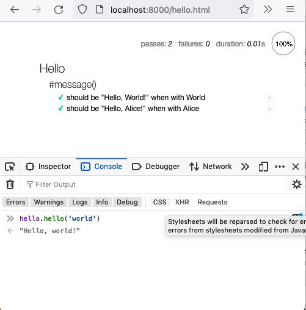

# Hello

The hello module (in hello.mjs) defines a function that creates greeting messages.

- `hello.html` --- wrapper to load module so that hello module it loaded and local mocha/chai tests are executed.  `hello` is available in the console for debugging.  For cross-site scripting protection this must be delivered via a web server via `npm run server` or `yarn run server`.  (probably in a container, ./run npm run server).  After the server is running, you can open `http://localhost:8000/hello.html` to locally run/debug.

- `hello.mjs`  --- hello module that defines and exports hello function.

- `test/hellotest.mjs` --- tests that are run on the server through `npm test` (probably in a container, ./run npm test).



## Build

```bash
make all
```

## Test

```bash
make test
```


## Docker

This can be run from a container with `./run cmds...`  `./run` with no arguments creates a shell into the running container.

