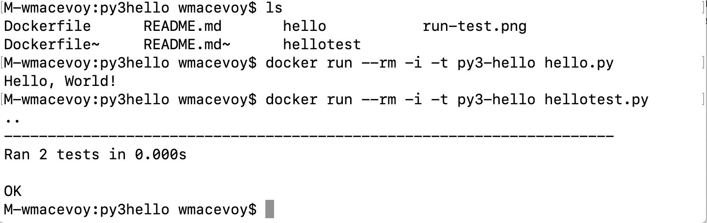

# Hello

Make a hello function that can return greeting messages.  The project structure is to have the functionality in the `hello` directory, and the corresponding tests in `hellotest`

```
hello/*.py
hellotest/*.py
```

## Test

```bash
hellotest/hellotest.py
```

## Run

```bash
hello/hello.py
```
## Clean-Build-Test Screen Capture



## Docker

To create a reproducible build (advanced) and you have docker installed, you can do the following:

```bash
docker build -t py3-hello .
docker run -i --rm -t py3-hello hellotest.py # test
docker run -i --rm -t py3-hello hello.py # run
```

## References

1. [Python Unit tests](https://docs.python.org/2/library/unittest.html)


